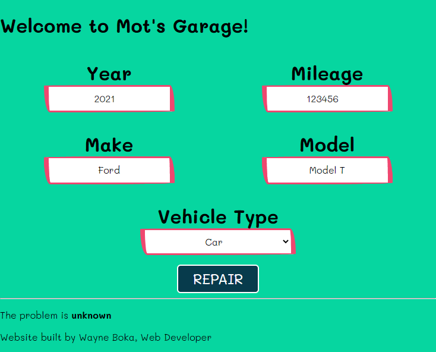

# Kids Mechanic Simulator (WORKING TITLE)

> Kids mechanic simulator for Hacktoberfest 2021. Proof of concept for potential kids museum. Inspired by doctor diagnosis simulator found in Lewisburg Childrens Museum.



## Features

(Defaults)

- Vehicle Troubleshooting Form
  - Year (Current year)
  - Make (Ford)
  - Model (Model T)
  - Type of Vehicle (CAR)
  - Mileage (123456)
  - `Returns`
    - problem as a `string`

## Objectives

- Problem Solving
- Sequences

## App Info

This is a [Next.js](https://nextjs.org/) project bootstrapped with [`create-next-app`](https://github.com/vercel/next.js/tree/canary/packages/create-next-app).

## Getting Started

First, install dependencies:

``` bash
npm i
# or
npm install
# or
yarn
#or
yarn install
```

Next, run the development server:

```bash
npm run dev
# or
yarn dev
```

Open [http://localhost:3000](http://localhost:3000) with your browser to see the result.

You can start editing the page by modifying `pages/index.tsx`. The page auto-updates as you edit the file.

[API routes](https://nextjs.org/docs/api-routes/introduction) can be accessed on [http://localhost:3000/api/diagnose](http://localhost:3000/api/diagnose). This endpoint can be edited in `pages/api/diagnose.ts`.

The `pages/api` directory is mapped to `/api/*`. Files in this directory are treated as [API routes](https://nextjs.org/docs/api-routes/introduction) instead of React pages.

## Learn More

To learn more about Next.js, take a look at the following resources:

- [Next.js Documentation](https://nextjs.org/docs) - learn about Next.js features and API.
- [Learn Next.js](https://nextjs.org/learn) - an interactive Next.js tutorial.

You can check out [the Next.js GitHub repository](https://github.com/vercel/next.js/) - your feedback and contributions are welcome!

## Deploy on Vercel

The easiest way to deploy your Next.js app is to use the [Vercel Platform](https://vercel.com/new?utm_medium=default-template&filter=next.js&utm_source=create-next-app&utm_campaign=create-next-app-readme) from the creators of Next.js.

Check out our [Next.js deployment documentation](https://nextjs.org/docs/deployment) for more details.

## Color Palette

https://coolors.co/ef476f-ffd166-06d6a0-118ab2-073b4c
